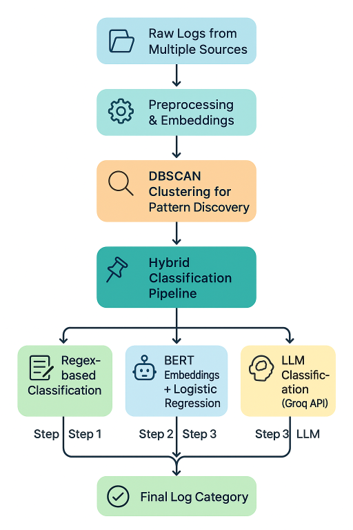

## Log-Classification-System
Logs generated by systems, applications, and CRM platforms contain valuable information about user actions, workflow processes, system events, and potential errors. Efficiently analyzing and classifying these logs is crucial for monitoring, troubleshooting, and deriving actionable insights. This project implements a hybrid log classification system that combines traditional Regex patterns, BERT embeddings, and Large Language Models (LLMs) to automatically categorize logs into meaningful groups such as user activities, workflow errors, system notifications, and deprecation warnings. By leveraging multiple techniques, the system achieves higher accuracy and robustness, enabling better alerting, analytics, and operational efficiency.

# Features
1. Regex-based Classification: Handles common and predictable log patterns efficiently.
2. BERT-based Classification: Uses SentenceTransformers embeddings with a LogisticRegression model to classify logs that cannot be handled by regex.
3. LLM-based Classification: Uses Groq LLM API for legacy systems or complex log messages that require semantic understanding.
4. Hybrid Approach: Combines regex, BERT, and LLM to ensure high accuracy and coverage.
5. Clustering for Pattern Discovery: Uses DBSCAN on embeddings to identify frequently occurring log patterns.
6. CSV Integration: Accepts log data in CSV format and outputs classified results.

# Project Structure

├── dataset/
│   └── synthetic_logs.csv        # Sample log dataset
├── models/
│   └── log_classifier.joblib     # Pre-trained BERT classifier
├── processor_regex.py            # Regex-based classification
├── processor_bert.py             # BERT-based classification
├── processor_llm.py              # LLM-based classification
├── classify.py                   # Main classification script
├── training/
│   ├── training.py               # Training & clustering script
│   └── dataset/
│       └── synthetic_logs.csv    # Dataset for training
└── README.md
